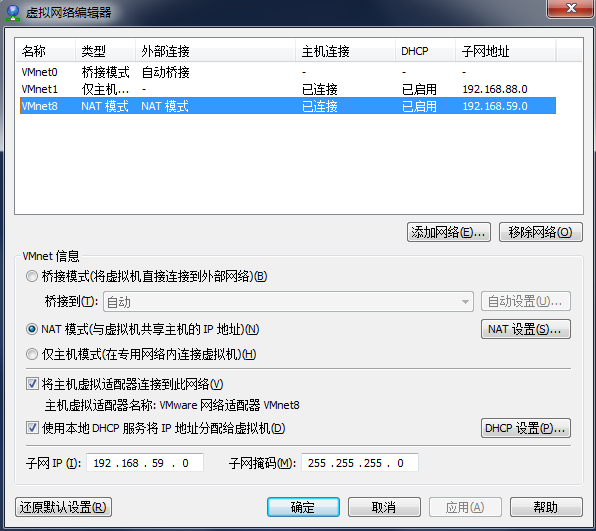
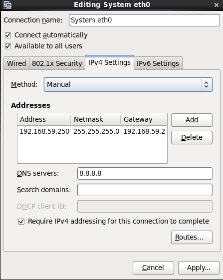
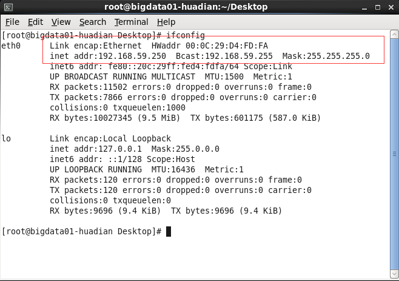
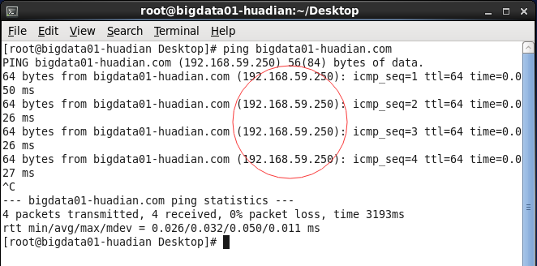
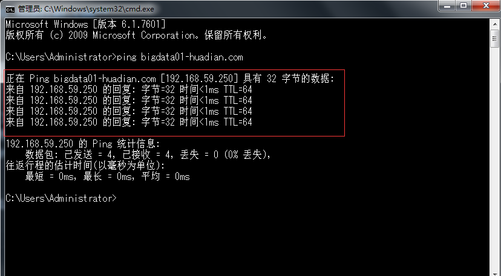

## Linux 基本环境配置

> 以下修改操作需要在 root 管理员权限下  
> 所以先通过 su - 命令切换到 root 环境下

### 修改主机名  

> 执行下面命令修改主机名（临时）
```sh
hostname bigdata01-huadian.com
```

> 修改主机名（永久）  
> 1.执行下面命令进入相应文件  
> 2.按下键盘的 "i" 键进入编辑模式
```sh
vim /etc/sysconfig/network
```
> 3.将 **HOSTNAME** 修改如下
```
HOSTNAME=bigdata01-huadian.com
```
> 4.按下 **esc** 输入 **:wq** 保存并退出  

### 网络配置
> 修改虚拟机  
> 1.打开 **VMware** -> 编辑 -> 虚拟网络编辑器  
> 2.将 VMware 当成一个路由器使用，设置路由器网段 **192.168.59.0**



> 设置网络方式  
> 1.打开 **Linux** 中 **System** -> **Preferences** -> **Network Connections**  
> 2.使用图形化界面操作将 ip 设置成 **192.168.59.250**

  

### 重启机器
> 执行命令 reboot 命令  
> 使用 **ifconfig** 查看



### 网络映射

> (在 **Linux** 上执行)  
> 目的：让linux的IP和主机名称一一对应，后期可以通过主机名找到机器  
> 执行命令 进入 **hosts** 文件
```sh
vi /etc/hosts
```
> 添加以下内容
```
192.168.59.250 bigdata01-huadian.com
```

> 终端中 **ping bigdata01-huadian.com** 
> 出现以下结果表示成功




> (在 **windows** 上执行)   
> 目的：在 window 下也能够通过主机名访问 linux
> 修改文件：C:\Windows\System32\drivers\etc\hosts   
> 新增如下内容:  
```
192.168.59.250 bigdata01-huadian.com
```

> 在 **cmd** 中 **ping bigdata01-huadian.com**



