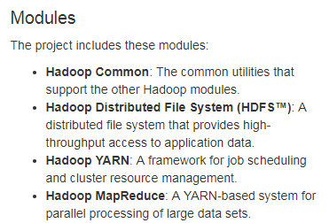
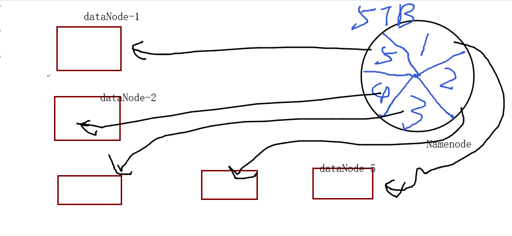
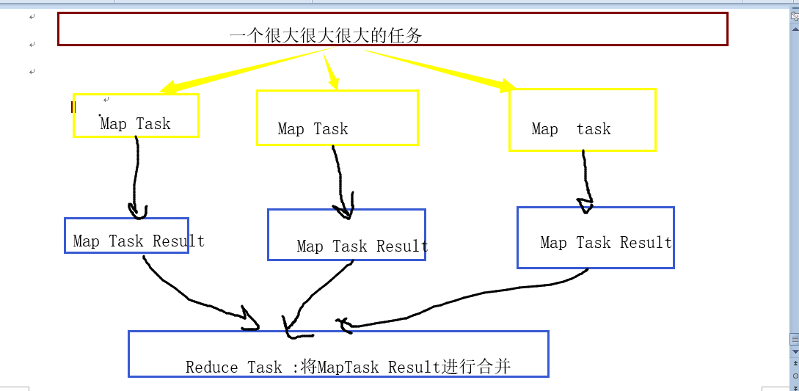

### Google的三篇论文

> Google FS (Google File System)

1.可扩展的分布式文件系统，用于大型的、分布式的、对大量数据进行访问的应用  
2.对海量数据进程存储  
3.后人根据此论文开发出 **HDFS**

本质： 文件被分割成很多块，使用冗余的方式（备份）储存于商用机器集群上。

> MapReduce

大数据的分布式计算方式，主要思想是将任务分解然后在多台处理能力较弱的计算节点中同时处理，然后将结果合并从而完成大数据处理。  
后人根据此论文开发出 **MapReduce**

> BigTable

十几亿行，百万列的数据库  
演变成后来的 **Hbase**

### 相关概念

> 分布式 

相对于集中式  
集中式：一台机器，将所有的东西（软件）放在一台机器上（安装）  
分布式：多台机器，将东西进行划分，每台机器存储一部分  

主从架构：  
主节点：只有一个（管理者，调度）  
从节点：多个（被管理者，干活的）

### hadoop 模块

附上一张官网 hadoop 模块图  

> common  

公共模块，工具，为其他模式提供支撑的。

> HDFS (Hadoop Distributed File System)

功能： 存储数据  
主节点： **namenode** 决定数据存储到哪个 **datanode**  
从节点： datanode 真正存储数据的  

> YARN  

分布式集群资源管理和任务调度  
管理着整个集群的资源（内存、CPU）  
主节点： resourceManager  管理整个集群资源的  
从节点： nodeManager  管理当前机器资源  

> MapReduce  

1.并行数据处理框架  
2.分而治之思想：将海量的数据划分为多块，每块数据进行单独处理，最终将结果进行合并。  
3.map: map task   
　　单独处理每一部分数据 各个Map Task是并行的，各跑各的，在不同的机器里面  
4.reduce: reduce task   
　　合并所有的Map Task 结果

总结：  
HDFS: namenode/datanode  
YARN: resoureManager/nodemanager  
都属于Java进程，启动JVM进程，运行服务

