本篇文章主要是讲 linux 命令下载并安装 jdk 和 mysql，为后面的大数据做准备

### Linux 软件安装命令

#### rpm 
> 安装 rpm 结尾的软件包  
> 软件查询： rpm –qa: 列举所有当前安装rpm包  
> 安装软件:  rpm – ivh XXX.rpm
> 问题： A <-B <-C  需要自己手动解决依赖  
> 卸载： rpm -e  --nodeps  XXXXX

#### yum
> 通过软件源进行安装,类似 软件软件 点击“安装”  
> 查看所有yum支持的包:yum list  
>	查看当前已经安装的包：yum list installed  
>	卸载：yum remove XX  
>	安装：yum install –y zip  

#### 绿色版本

> 绝大部分都是解压直接能用

### Linux 虚拟机安装 jdk 并 配置环境变量

> **步骤 1**  
> 将 jdk 的包通过 远程控制工具 SearchSRC 上传到 Linux 虚拟机中

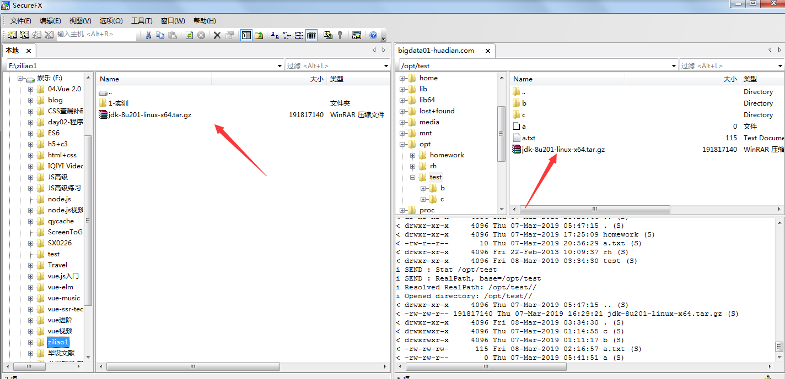

> **步骤 2**  
> 使用 tar –zxvf jdk-8u91-linux-x64.tar.gz  -C  ./ 解压到当前文件夹

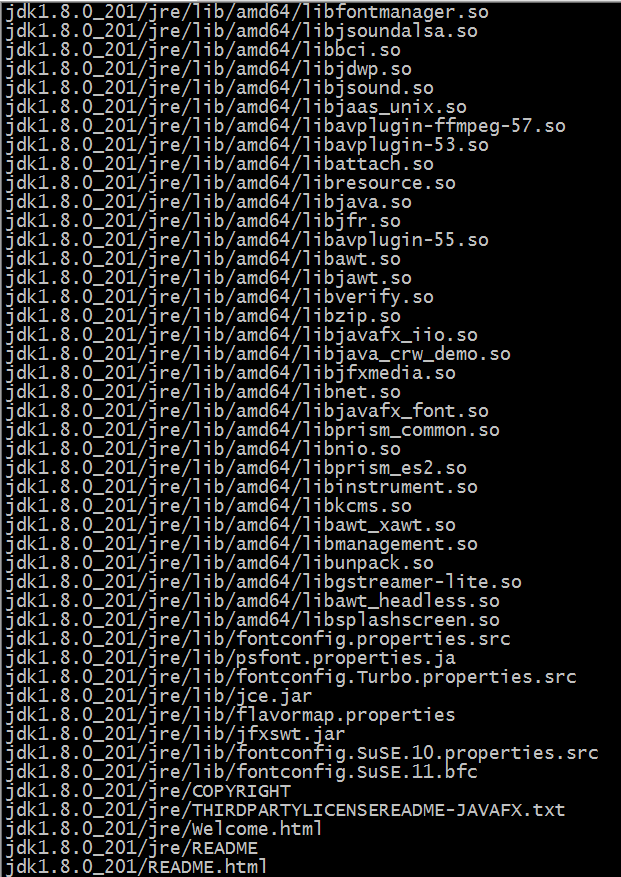

> 查看 test 文件夹

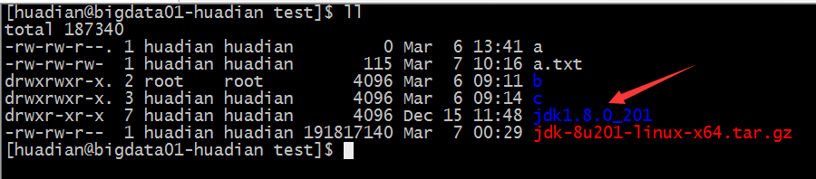

> **步骤 3**  
> sudo vi /etc/profile 配置环境变量

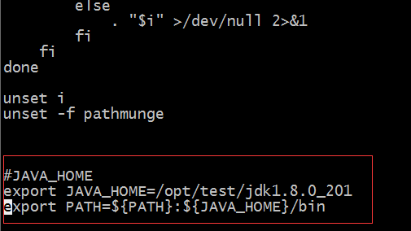

> 保存退出后 source /etc/profile 使其生效

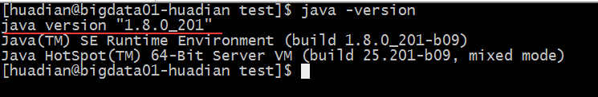

### 安装 mysql

> **步骤 1**  
> 检查是否已经安装 mysql
> 命令: rpm -qa | grep mysql

> 卸载依赖  
> 命令：sudo rpm -e  --nodeps mysql-libs-5.1.66-2.el6_3.x86_64

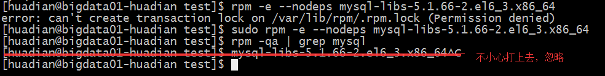

> 安装mysql  
> 命令：sudo yum install -y mysql-server

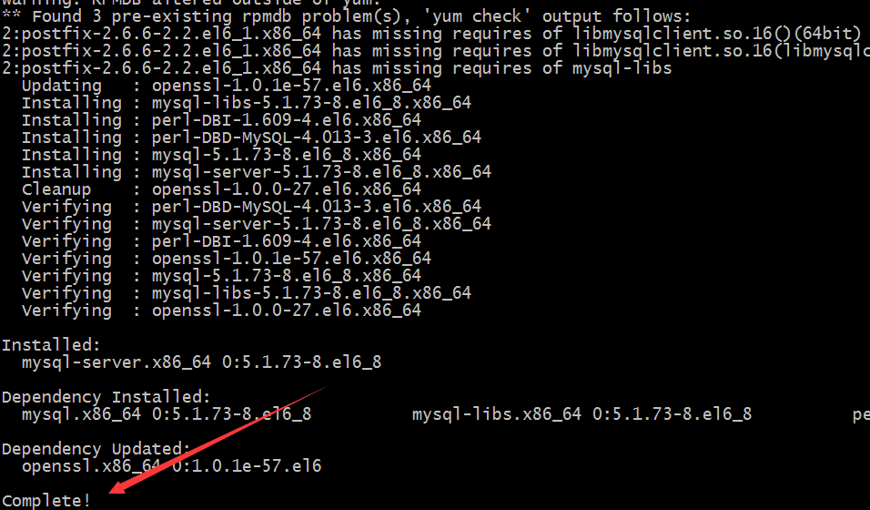

> 启动 mysql 服务  
> 命令: sudo service mysqld start

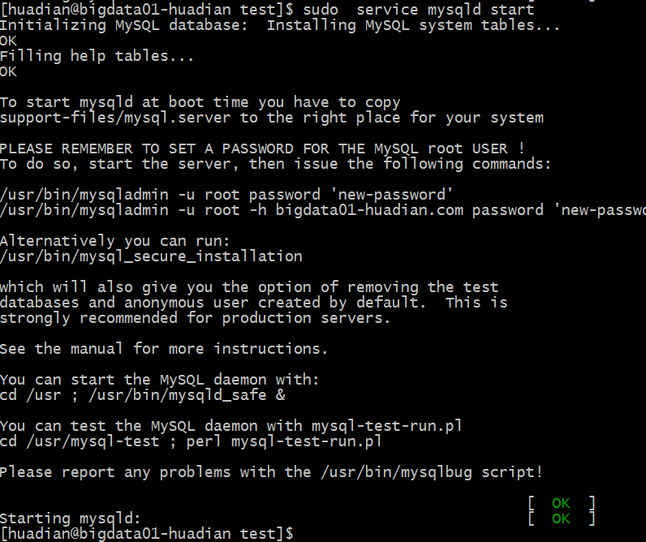

> 修改 mysql 密码为 123456  
> 命令：/usr/bin/mysqladmin -u root password '123456'

> 登录 mysql  
> 命令：mysql -u root -p123456

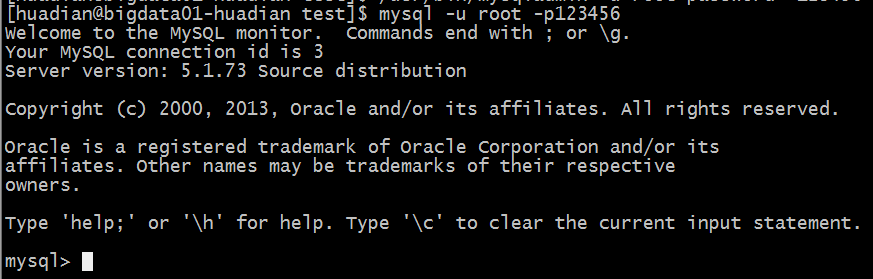

> 展示数据库 
> 命令：show databases

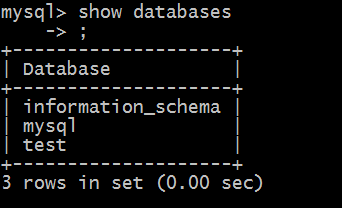

> 设置开机启动 

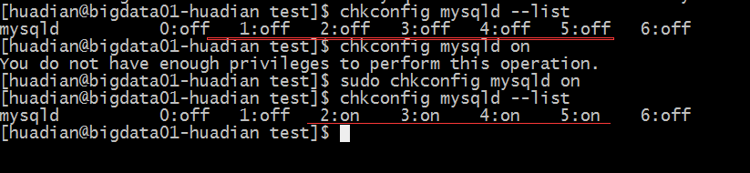

经过以上步骤，jdk 和 mysql 都安装完成!

